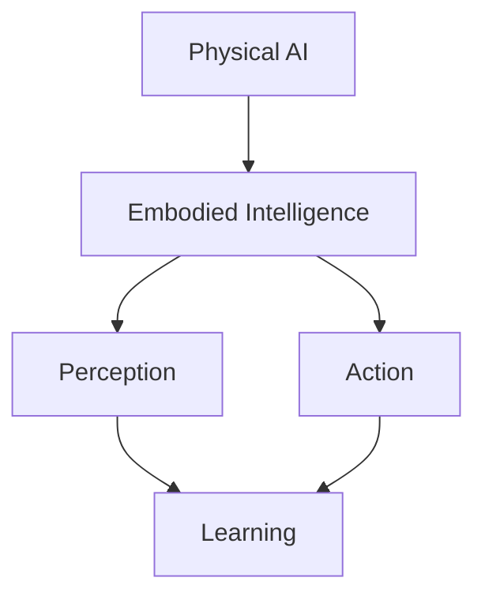

# Quickstart Guide: Physical AI & Humanoid Robotics Textbook

## Prerequisites

Before you begin developing content for the Physical AI & Humanoid Robotics textbook, ensure you have the following installed:

- Node.js (v18 or higher)
- npm or yarn package manager
- Git version control
- A modern web browser for previewing content
- Python 3.8+ for RAG implementation
- Docker (optional, for simulation environments)

## Setting Up the Development Environment

### 1. Clone the Repository
```bash
git clone [repository-url]
cd hackathon-physical-ai-and-humanoid-robotics-book
```

### 2. Install Docusaurus Dependencies
```bash
cd site
npm install
```

### 3. Install Additional Dependencies for Robotics Content
```bash
# ROS 2 Humble Hawksbill setup (Ubuntu/Debian)
sudo apt update
sudo apt install ros-humble-desktop
source /opt/ros/humble/setup.bash

# For Windows/Mac users, consider using Docker or WSL
```

### 4. Start the Development Server
```bash
cd site
npm start
```

This command starts a local development server and opens a browser window with the textbook content. Most changes are reflected live without restarting the server.

## Creating New Content

### Adding a New Chapter

1. Create a new markdown file in the appropriate module directory:
```bash
touch site/docs/module-1/chapter-1.5-new-chapter.md
```

2. Add the following frontmatter to your chapter file:
```markdown
---
title: Chapter Title
sidebar_position: 5
description: Brief description of the chapter content
---

# Chapter Title

Your chapter content here...
```

3. Update the `sidebars.js` file to include your new chapter in the navigation.

### Adding Interactive Elements

To include code snippets with syntax highlighting:
```markdown
import CodeBlock from '@theme/CodeBlock';
import Tabs from '@theme/Tabs';
import TabItem from '@theme/TabItem';

<Tabs>
<TabItem value="python" label="Python">
```python
def example_function():
    print("Hello, Physical AI!")
```
</TabItem>
<TabItem value="cpp" label="C++">
```cpp
#include <iostream>
int main() {
    std::cout << "Hello, Physical AI!" << std::endl;
    return 0;
}
```
</TabItem>
</Tabs>
```

### Adding Figures and Diagrams

Place images in the `site/static/img/` directory and reference them in your content:

```markdown

```

For complex diagrams, consider using Mermaid syntax:

```markdown

```

## Building for Production

To build the static files for deployment:

```bash
cd site
npm run build
```

This generates a `build` directory with all the static files that can be served by any static hosting service.

## Running Tests

To verify content quality and links:

```bash
# Check for broken links
npm run serve
# Then run link checker

# Validate markdown syntax
npx markdownlint "**/*.md"
```

## Simulation Environment Setup

For hands-on labs requiring simulation:

### Gazebo Setup
```bash
# Install Gazebo Garden
sudo apt install gazebo
# Or use Docker:
docker pull gazebo:gz-garden
```

### Unity Setup
- Download Unity Hub from unity.com
- Install Unity 2022.3 LTS version
- Import robotics packages via Package Manager

### NVIDIA Isaac Setup
```bash
# Install Isaac ROS dependencies
sudo apt install ros-humble-isaac-ros*
```

## RAG System Configuration

For RAG (Retrieval-Augmented Generation) functionality:

1. Install Python dependencies:
```bash
pip install -r requirements.txt
```

2. Set up vector database:
```bash
# For development
docker run -p 6333:6333 qdrant/qdrant

# For production, consider cloud vector databases
```

3. Configure API keys in environment:
```bash
export OPENAI_API_KEY=your-key-here
export QDRANT_URL=your-qdrant-url
```

## Common Development Tasks

### Updating Module Structure
1. Modify `sidebars.js` to reflect new content organization
2. Update navigation in `docusaurus.config.js` if needed
3. Test navigation locally before committing

### Adding New Module
1. Create new directory: `site/docs/module-7/` (to extend beyond the current 6 modules)
2. Add main module file: `site/docs/module-7/index.md`
3. Update `sidebars.js` to include new module
4. Update `docusaurus.config.js` if creating new navigation category

### Content Review Process
1. Verify all code examples run correctly
2. Check all links are valid
3. Ensure accessibility standards are met (alt text, proper heading hierarchy)
4. Test on multiple screen sizes
5. Validate RAG chunking works properly

## Troubleshooting

### Common Issues

**Problem**: Local server won't start
**Solution**: Clear cache and reinstall dependencies:
```bash
rm -rf node_modules package-lock.json
npm install
npm start
```

**Problem**: Images not displaying
**Solution**: Ensure images are in `site/static/` directory and referenced with absolute paths

**Problem**: Build fails
**Solution**: Check for syntax errors in markdown files, especially frontmatter sections

## Deployment

The textbook can be deployed to various platforms:

- **GitHub Pages**: Use GitHub Actions workflow
- **Netlify/Vercel**: Connect repository and deploy automatically
- **Self-hosted**: Serve the `build` directory with any web server

For detailed deployment options, see the Docusaurus documentation.